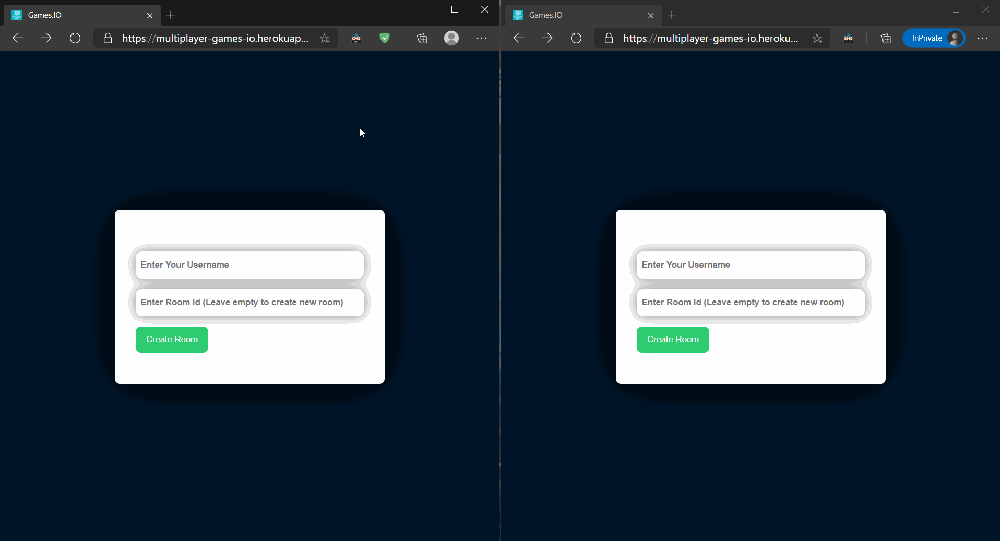
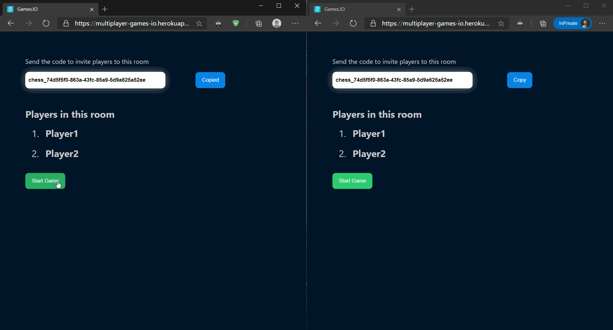
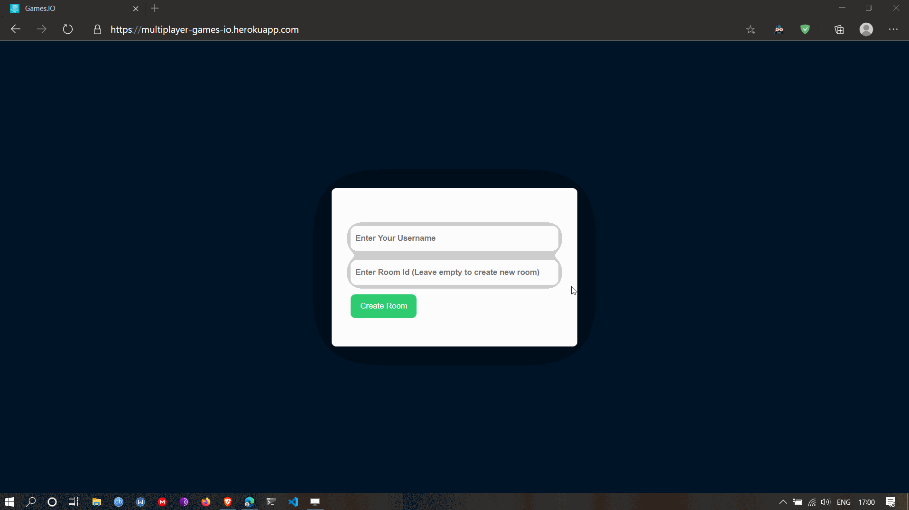

# What is it?

Multiplayer games made using SocketIO, React and NodeJS. In-game chat is available for all games

## Games you can play

1. Chess
2. Checkers
3. Sketchio ([SkribblIO](https://skribbl.io/) clone)

> # Live
>
> https://multiplayer-games-io.herokuapp.com/

# 1. Chess Demo

-   Multiplayer Chess
    

-   Pawn Promotion
    

# 2. SketchIO

# 3. Checkers

-   Multiplayer Checkers
    
